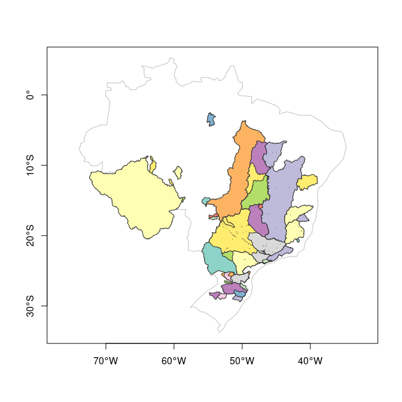

<!-- README.md is generated from README.Rmd. Please edit that file -->

# HEgis

<!-- badges: start -->

[](https://www.tidyverse.org/lifecycle/#experimental)
<!-- badges: end -->

The goal of HEgis is to prepare GIS data for use in HydroEngie R\&D
project.

## Installation

You can install HEgis from [github](https://github.com/lhmet/HEgis)
with:

``` r
library(devtools)
install_github("lhmet/HEgis")
```

<!-- BEFORE RUN (RE)INSTALL THE PACKAGE -->

## Example

So far there are functions for:

  - extract shapefiles from compressed file (`.rar`)

  - import shape file contained in the `.rar` file

This is a basic example which shows how to extract shape files from the
rar file (`BaciasHidrograficasONS_JUNTOS.rar`) available with `HEgis`
package.

``` r
library(HEgis)

## rar file included in the package
bhs_rar_file <- system.file(
   "extdata",
   "BaciasHidrograficasONS_JUNTOS.rar",
    package = "HEgis"
)
# extracted shapefiles
shapes <- extract_rar(bhs_rar_file, overwrite = TRUE)
shapes
#> /home/hidrometeorologista/.R/libs/HEgis/extdata/BaciasHidrograficasONS_JUNTOS/BaciasHidrograifcasUHEsONS.shp
#> /home/hidrometeorologista/.R/libs/HEgis/extdata/BaciasHidrograficasONS_JUNTOS/LagoBarragemONS.shp
```

Now we select the shape of interest and then import it.

``` r
shape_bhs <- shapes[grep("Bacias", fs::path_file(shapes))]
pols_bhs <- import_bhs_ons(shape_bhs)
#> Rows: 87
#> Columns: 10
#> $ codONS   <chr> "266", "291", "211", "134", "245", "197", "295", "296", "240…
#> $ codANA   <chr> "11735", "62833", "3581", "3875", "8124", "3626", "14588", "…
#> $ nome     <chr> "ITAIPU", "DARDANELOS", "FUNIL-GRANDE", "SALTO GRANDE", "JUP…
#> $ nomeOri  <chr> "UHE Itaipu", NA, "UHE Funil", "UHE Salto Grande", "UHE Jupi…
#> $ adkm2    <dbl> 822904.3332, 15332.6072, 15720.0056, 2476.7163, 476527.7329,…
#> $ volhm3   <dbl> 29403.91, NA, 268.93, 78.00, 3354.00, 7.09, 17.15, 21.00, 74…
#> $ rio      <chr> "Rio Paraná", "Rio Aripuanã", "Rio Grande", "Rio Guanhães", …
#> $ cobacia  <chr> "8631311", "46293331", "86895773", "7766211", "865775", "778…
#> $ tpopera  <chr> "Fio d'água", NA, "Fio d'água", "Fio d'água", "Fio d'água", …
#> $ geometry <POLYGON> POLYGON ((-43.60082 -21.168..., POLYGON ((-59.35952 -11.…
#> Simple feature collection with 87 features and 9 fields
#> geometry type:  POLYGON
#> dimension:      XY
#> bbox:           xmin: -72.41788 ymin: -29.41284 xmax: -38.93867 ymax: -2.495375
#> CRS:            NA
#> First 10 features:
#>    codONS codANA         nome          nomeOri      adkm2   volhm3          rio
#> 1     266  11735       ITAIPU       UHE Itaipu 822904.333 29403.91   Rio Paraná
#> 2     291  62833   DARDANELOS             <NA>  15332.607       NA Rio Aripuanã
#> 3     211   3581 FUNIL-GRANDE        UHE Funil  15720.006   268.93   Rio Grande
#> 4     134   3875 SALTO GRANDE UHE Salto Grande   2476.716    78.00 Rio Guanhães
#> 5     245   8124        JUPIA        UHE Jupiá 476527.733  3354.00   Rio Paraná
#> 6     197   3626       PICADA       UHE Picada   1725.833     7.09 Rio do Peixe
#> 7     295  14588        JAURU        UHE Jauru   2245.733    17.15         <NA>
#> 8     296  14589      GUAPORE      UHE Guaporé   1344.294    21.00  Rio Guaporé
#> 9     240   8013    PROMISSAO    UHE Promissão  57841.510  7408.00    Rio Tietê
#> 10    216   7607 CAMPOS NOVOS UHE Campos Novos  14445.832  1477.00   Rio Canoas
#>     cobacia        tpopera                       geometry
#> 1   8631311     Fio d'água POLYGON ((-43.60082 -21.168...
#> 2  46293331           <NA> POLYGON ((-59.35952 -11.975...
#> 3  86895773     Fio d'água POLYGON ((-44.50861 -22.224...
#> 4   7766211     Fio d'água POLYGON ((-43.04034 -18.603...
#> 5    865775     Fio d'água POLYGON ((-46.35946 -23.273...
#> 6   7788753     Fio d'água POLYGON ((-43.89604 -21.974...
#> 7  89969715     Fio d'água POLYGON ((-58.76821 -14.676...
#> 8   4699693     Fio d'água POLYGON ((-58.90869 -14.595...
#> 9   8661373 Regulariza_ONS POLYGON ((-46.10237 -22.999...
#> 10   829173 Regulariza_ONS POLYGON ((-49.44034 -28.132...
sf::st_crs(pols_bhs) <- "+proj=longlat +datum=WGS84"
class(pols_bhs)
#> [1] "sf"         "data.frame"
sf::st_geometry_type(pols_bhs, FALSE)
#> [1] POLYGON
#> 18 Levels: GEOMETRY POINT LINESTRING POLYGON MULTIPOINT ... TRIANGLE
```

We can view the major watersheds (87) from SIN by:

``` r
library(sf)
#> Linking to GEOS 3.8.0, GDAL 3.0.4, PROJ 6.3.1
library(spData)
#> To access larger datasets in this package, install the spDataLarge
#> package with: `install.packages('spDataLarge',
#> repos='https://nowosad.github.io/drat/', type='source')`
sa <- world[world$continent == "South America", ]
br <- world[world$name_long == "Brazil", ]

set.seed(12)
ord_areas <- order(pols_bhs$adkm2, decreasing = TRUE)
cols <- sample(colors(), size = nrow(pols_bhs))
plot(sf::st_geometry(sa), 
     axes = TRUE,
     border = "grey", 
     xlim = c(-80, -30),
     ylim = c(-40, 10)
     )
plot(sf::st_geometry(br), axes = TRUE, border = "grey60", lwd = 2, add = TRUE)
# from highest to lower drainage areas
for (i in ord_areas) {
  # i <- ord_areas[1]
  plot(st_geometry(pols_bhs)[i],
    add = TRUE,
    col = cols[i],
    border = 1,
    lwd = 0.7
  )
}
```


