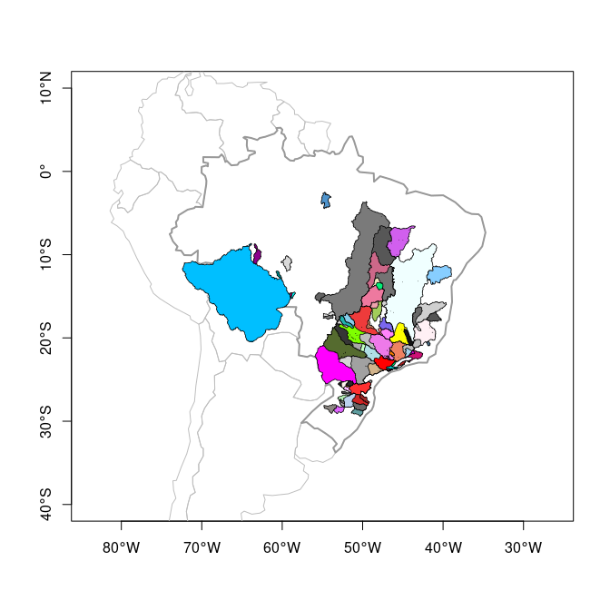
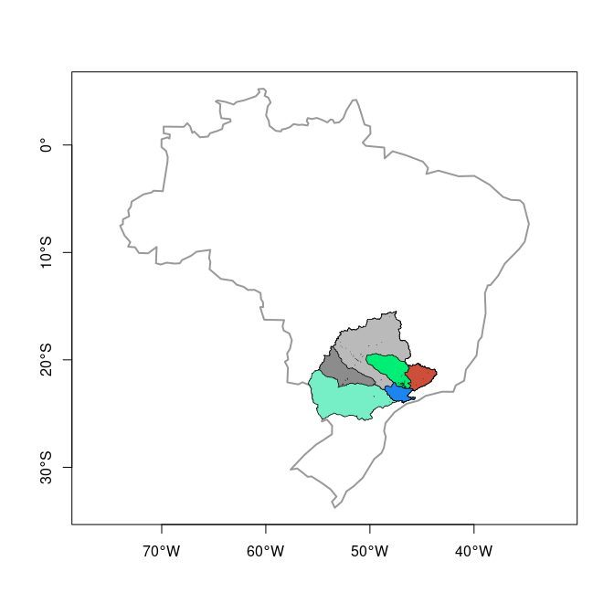

<!-- README.md is generated from README.Rmd. Please edit that file -->

# HEgis

<!-- badges: start -->

[](https://www.tidyverse.org/lifecycle/#experimental)
[](https://codecov.io/gh/lhmet/HEgis?branch=master)
<!-- badges: end -->

The goal of HEgis is to prepare GIS data for use in HydroEngie R\&D
project.

So far now `import_bhs_ons()` is the only function.

## Installation

You can install HEgis from [github](https://github.com/lhmet/HEgis)
with:

``` r
library(devtools)
install_github("lhmet/HEgis")
```

<!-- BEFORE RUN (RE)INSTALL THE PACKAGE -->

## Example

A shapefile with the watersheds of major Hydroelectric Power plants from
ONS is available with `{HEgis}` package.

``` r
library(sf)
#> Linking to GEOS 3.8.0, GDAL 3.0.4, PROJ 6.3.1
library(spData)
#> To access larger datasets in this package, install the spDataLarge
#> package with: `install.packages('spDataLarge',
#> repos='https://nowosad.github.io/drat/', type='source')`
library()
#> Warning in library(): library '/usr/local/lib/R/site-library' contains no
#> packages
library(HEgis)
bhs_rar <- system.file(
  "extdata",
  "BaciasHidrograficasONS_JUNTOS.rar",
  package = "HEgis"
)
```

We need to extract the `rar` file to import the shapefile. We can do
this with `lhmetools::urar()`.

``` r
if (requireNamespace("lhmetools", quietly = TRUE)) {
  library(lhmetools)
  (shps <- unrar(bhs_rar, dest_dir = tempdir()))
}
#> /tmp/Rtmp4xgHBa/BaciasHidrograficasONS_JUNTOS/BaciasHidrograifcasUHEsONS.cpg
#> /tmp/Rtmp4xgHBa/BaciasHidrograficasONS_JUNTOS/BaciasHidrograifcasUHEsONS.dbf
#> /tmp/Rtmp4xgHBa/BaciasHidrograficasONS_JUNTOS/BaciasHidrograifcasUHEsONS.shp
#> /tmp/Rtmp4xgHBa/BaciasHidrograficasONS_JUNTOS/BaciasHidrograifcasUHEsONS.shx
#> /tmp/Rtmp4xgHBa/BaciasHidrograficasONS_JUNTOS/LagoBarragemONS.cpg
#> /tmp/Rtmp4xgHBa/BaciasHidrograficasONS_JUNTOS/LagoBarragemONS.dbf
#> /tmp/Rtmp4xgHBa/BaciasHidrograficasONS_JUNTOS/LagoBarragemONS.shp
#> /tmp/Rtmp4xgHBa/BaciasHidrograficasONS_JUNTOS/LagoBarragemONS.shx
```

Now we select the shapefile of interest and then import it.

``` r
(bhs_shp <- shps[grep("Bacias.*\\.shp$", fs::path_file(shps))])
#> /tmp/Rtmp4xgHBa/BaciasHidrograficasONS_JUNTOS/BaciasHidrograifcasUHEsONS.shp
```

``` r
bhs_pols <- import_bhs_ons(bhs_shp, quiet = TRUE)
st_crs(bhs_pols) <- "+proj=longlat +datum=WGS84"
class(bhs_pols)
#> [1] "sf"         "data.frame"
st_geometry_type(bhs_pols, FALSE)
#> [1] POLYGON
#> 18 Levels: GEOMETRY POINT LINESTRING POLYGON MULTIPOINT ... TRIANGLE
```

We can view the major watersheds (87) with:

``` r
sa <- world[world$continent == "South America", ]
br <- world[world$name_long == "Brazil", ]

set.seed(12)
ord_areas <- order(bhs_pols$adkm2, decreasing = TRUE)
cols <- sample(colors(), size = nrow(bhs_pols))
plot(st_geometry(sa), 
     axes = TRUE,
     border = "grey", 
     xlim = c(-80, -30),
     ylim = c(-40, 10)
     )
plot(st_geometry(br), axes = TRUE, border = "grey60", lwd = 2, add = TRUE)
# from highest to lower drainage areas
for (i in ord_areas) {
  # i <- ord_areas[1]
  plot(st_geometry(bhs_pols)[i],
    add = TRUE,
    col = cols[i],
    border = 1,
    lwd = 0.7
  )
}
```



Principais UHEs do Rio Paraná.

``` r
library(tidyverse)
#> ── Attaching packages ───────────────────────────────────────────── tidyverse 1.3.0 ──
#> ✓ ggplot2 3.3.2     ✓ purrr   0.3.4
#> ✓ tibble  3.0.3     ✓ dplyr   1.0.2
#> ✓ tidyr   1.1.1     ✓ stringr 1.4.0
#> ✓ readr   1.3.1     ✓ forcats 0.5.0
#> ── Conflicts ──────────────────────────────────────────────── tidyverse_conflicts() ──
#> x dplyr::filter() masks stats::filter()
#> x dplyr::lag()    masks stats::lag()
#sort(bhs_pols$nome)
bhs_pr <- filter(bhs_pols, nome %in% 
         c("ITAIPU", "P_PRIMAVERA", "JUPIA", "A_VERMELHA", "BARRA_BONITA", "FURNAS")
       )
bhs_pr
#> Simple feature collection with 6 features and 9 fields
#> geometry type:  POLYGON
#> dimension:      XY
#> bbox:           xmin: -55.94828 ymin: -25.65613 xmax: -43.58262 ymax: -15.45577
#> CRS:            +proj=longlat +datum=WGS84
#>   codONS codANA         nome             nomeOri     adkm2   volhm3        rio
#> 1    266  11735       ITAIPU          UHE Itaipu 822904.33 29403.91 Rio Paraná
#> 2    245   8124        JUPIA           UHE Jupiá 476527.73  3354.00 Rio Paraná
#> 3     18   8292   A_VERMELHA   UHE Água Vermelha 139154.89 11025.00 Rio Grande
#> 4    246   7773  P_PRIMAVERA UHE Porto Primavera 571692.41 20001.00       <NA>
#> 5      6   3460       FURNAS          UHE Furnas  51942.82 22950.00 Rio Grande
#> 6    237   7922 BARRA_BONITA    UHE Barra Bonita  32949.15  3160.00  Rio Tietê
#>    cobacia        tpopera                       geometry
#> 1  8631311     Fio d'água POLYGON ((-43.60082 -21.168...
#> 2   865775     Fio d'água POLYGON ((-46.35946 -23.273...
#> 3 86815373 Regulariza_ONS POLYGON ((-45.64278 -22.846...
#> 4   865131 Regulariza_ONS POLYGON ((-45.8879 -22.8752...
#> 5 86879933 Regulariza_ONS POLYGON ((-44.96669 -22.474...
#> 6 86659193 Regulariza_ONS POLYGON ((-46.04498 -22.929...
```

``` r
set.seed(6)
oa_pr <- order(bhs_pr$adkm2, decreasing = TRUE)
cols <- sample(colors(), size = nrow(bhs_pr))
plot(st_geometry(br), 
     axes = TRUE, 
     border = "grey60", 
     lwd = 2
     #add = TRUE
     )
# from highest to lower drainage areas
for (i in oa_pr) {
  # i <- ord_areas[1]
  plot(st_geometry(bhs_pr)[i],
    add = TRUE,
    col = cols[i],
    border = 1,
    lwd = 0.7
  )
}
```


