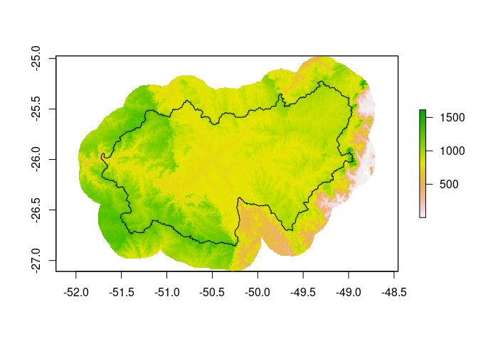

<!-- README.md is generated from README.Rmd. Please edit that file -->

# HEgis

<!-- badges: start -->

[](https://www.tidyverse.org/lifecycle/#experimental)
<!-- [](https://codecov.io/gh/lhmet-ped/HEgis?branch=master) -->
<!-- badges: end -->

The goal of HEgis is to prepare GIS data for use in HydroEngie R\&D
project. The main functions of are:

  - `import_bhs_ons()`: use it to import the shapefile with basins of
    major hydroelectric power dams.

  - `info_station()`: it is useful to get basic information from a ONS
    station.

  - `extract_poly()`: to extract a specific watershed polygon from the
    data set.

  - `extract_condem()`: to crop and mask a geographic subset of a
    raster. In this specific case the raster is a hydrologically
    conditioned elevation model.

## Installation

You can install **`{HEgis}`** from
[github](https://github.com/lhmet/HEgis) with:

``` r
library(devtools)
install_github("lhmet/HEgis")
```

<!-- BEFORE RUN (RE)INSTALL THE PACKAGE -->

We load the required packages using:

``` r
library(sf)
#> Linking to GEOS 3.8.0, GDAL 3.0.4, PROJ 6.3.1
library(spData)
#> To access larger datasets in this package, install the spDataLarge
#> package with: `install.packages('spDataLarge',
#> repos='https://nowosad.github.io/drat/', type='source')`
library(HEgis)
library(raster)
#> Loading required package: sp
library(lhmetools)
library(tidyverse)
#> ── Attaching packages ─────────────────────────────────────────────────── tidyverse 1.3.0 ──
#> ✓ ggplot2 3.3.2     ✓ purrr   0.3.4
#> ✓ tibble  3.0.3     ✓ dplyr   1.0.2
#> ✓ tidyr   1.1.2     ✓ stringr 1.4.0
#> ✓ readr   1.3.1     ✓ forcats 0.5.0
#> ── Conflicts ────────────────────────────────────────────────────── tidyverse_conflicts() ──
#> x tidyr::extract() masks raster::extract()
#> x dplyr::filter()  masks stats::filter()
#> x dplyr::lag()     masks stats::lag()
#> x dplyr::select()  masks raster::select()
```

## Watersheds

A shapefile with the watersheds of major Hydroelectric Power plants from
ONS is available with **`{HEgis}`** package automatically after you
install it. The path to the compacted file is obtained with the code
below:

``` r
bhs_rar <- system.file(
  "extdata",
  "BaciasHidrograficasONS_JUNTOS.rar",
  package = "HEgis"
)
bhs_rar
#> [1] "/home/hidrometeorologista/.R/libs/HEgis/extdata/BaciasHidrograficasONS_JUNTOS.rar"
```

We need to extract the `rar` file to import the shapefile. We can do
this with `lhmetools::unrar()`.

``` r
wherextract <- tempdir() 
# alternatively you can save in the same path as the compacted file
#wherextract <- file.path(.libPaths()[1], "HEgis", "extdata")
(shps <- unrar(bhs_rar, dest_dir = wherextract))
#> /tmp/RtmpFzVfM9/BaciasHidrograficasONS_JUNTOS/BaciasHidrograifcasUHEsONS.cpg
#> /tmp/RtmpFzVfM9/BaciasHidrograficasONS_JUNTOS/BaciasHidrograifcasUHEsONS.dbf
#> /tmp/RtmpFzVfM9/BaciasHidrograficasONS_JUNTOS/BaciasHidrograifcasUHEsONS.shp
#> /tmp/RtmpFzVfM9/BaciasHidrograficasONS_JUNTOS/BaciasHidrograifcasUHEsONS.shx
#> /tmp/RtmpFzVfM9/BaciasHidrograficasONS_JUNTOS/LagoBarragemONS.cpg
#> /tmp/RtmpFzVfM9/BaciasHidrograficasONS_JUNTOS/LagoBarragemONS.dbf
#> /tmp/RtmpFzVfM9/BaciasHidrograficasONS_JUNTOS/LagoBarragemONS.shp
#> /tmp/RtmpFzVfM9/BaciasHidrograficasONS_JUNTOS/LagoBarragemONS.shx
```

Now we select the shapefile of interest and then import it.

``` r
(bhs_shp <- shps[grep("Bacias.*\\.shp$", fs::path_file(shps))])
#> /tmp/RtmpFzVfM9/BaciasHidrograficasONS_JUNTOS/BaciasHidrograifcasUHEsONS.shp
```

``` r
bhs_pols <- import_bhs_ons(bhs_shp, quiet = TRUE)
st_crs(bhs_pols) <- 4674
bhs_pols
#> Simple feature collection with 87 features and 9 fields
#> geometry type:  POLYGON
#> dimension:      XY
#> bbox:           xmin: -72.41788 ymin: -29.41284 xmax: -38.93867 ymax: -2.495375
#> geographic CRS: SIRGAS 2000
#> First 10 features:
#>    codONS codANA         nome          nomeOri      adkm2   volhm3          rio
#> 1     266  11735       ITAIPU       UHE Itaipu 822904.333 29403.91   Rio Paraná
#> 2     291  62833   DARDANELOS             <NA>  15332.607       NA Rio Aripuanã
#> 3     211   3581 FUNIL-GRANDE        UHE Funil  15720.006   268.93   Rio Grande
#> 4     134   3875 SALTO GRANDE UHE Salto Grande   2476.716    78.00 Rio Guanhães
#> 5     245   8124        JUPIA        UHE Jupiá 476527.733  3354.00   Rio Paraná
#> 6     197   3626       PICADA       UHE Picada   1725.833     7.09 Rio do Peixe
#> 7     295  14588        JAURU        UHE Jauru   2245.733    17.15         <NA>
#> 8     296  14589      GUAPORE      UHE Guaporé   1344.294    21.00  Rio Guaporé
#> 9     240   8013    PROMISSAO    UHE Promissão  57841.510  7408.00    Rio Tietê
#> 10    216   7607 CAMPOS NOVOS UHE Campos Novos  14445.832  1477.00   Rio Canoas
#>     cobacia        tpopera                       geometry
#> 1   8631311     Fio d'água POLYGON ((-43.60082 -21.168...
#> 2  46293331           <NA> POLYGON ((-59.35952 -11.975...
#> 3  86895773     Fio d'água POLYGON ((-44.50861 -22.224...
#> 4   7766211     Fio d'água POLYGON ((-43.04034 -18.603...
#> 5    865775     Fio d'água POLYGON ((-46.35946 -23.273...
#> 6   7788753     Fio d'água POLYGON ((-43.89604 -21.974...
#> 7  89969715     Fio d'água POLYGON ((-58.76821 -14.676...
#> 8   4699693     Fio d'água POLYGON ((-58.90869 -14.595...
#> 9   8661373 Regulariza_ONS POLYGON ((-46.10237 -22.999...
#> 10   829173 Regulariza_ONS POLYGON ((-49.44034 -28.132...
```

We can view the major watersheds (87) with:

``` r
sa <- world[world$continent == "South America", ]
br <- world[world$name_long == "Brazil", ]

set.seed(12)
ord_areas <- order(bhs_pols$adkm2, decreasing = TRUE)
cols <- sample(colors(), size = nrow(bhs_pols))
plot(st_geometry(sa), 
     axes = TRUE,
     border = "grey", 
     xlim = c(-80, -30),
     ylim = c(-40, 10)
     )
plot(st_geometry(br), axes = TRUE, border = "grey60", lwd = 2, add = TRUE)
# from highest to lower drainage areas
for (i in ord_areas) {
  # i <- ord_areas[1]
  plot(st_geometry(bhs_pols)[i],
    add = TRUE,
    col = cols[i],
    border = 1,
    lwd = 0.7
  )
}
```


## Extraction from a specific watershed polygon

To extract a watershed polygon we first need the "station id" (posto).
We can get this information with the function `info_station()`, for
example for the HPP station of **G.B. MUNHOZ** we can use the following
code:

``` r
info_posto <- info_station(name_regex = "MUNHOZ")
info_posto
#> # A tibble: 1 x 10
#>     num nome        posto   jus   ree v_inic u_exis modif inic_hist fim_hist
#>   <int> <chr>       <int> <int> <int>  <dbl> <chr>  <int>     <int>    <int>
#> 1    74 G.B. MUNHOZ    74    76    11   29.2 EX         0      1931     2018
```

We now use the "station id" (posto) to select the polygon of interest.

``` r
(poly_posto <- extract_poly(station = info_posto$posto))
#> The data is not projected. We are taking CRS as SIRGAS 2000 (EPSG: 4674), the same as that of BHO-ANA on which the provider was based.
#> Simple feature collection with 1 feature and 9 fields
#> geometry type:  POLYGON
#> dimension:      XY
#> bbox:           xmin: -51.72274 ymin: -26.85503 xmax: -48.94853 ymax: -25.22428
#> geographic CRS: SIRGAS 2000
#>   codONS codANA       nome                                   nomeOri    adkm2
#> 1     74   7659 G_B_MUNHOZ UHE Governador Bento Munhoz da Rocha Neto 30207.57
#>   volhm3        rio cobacia        tpopera                       geometry
#> 1   5779 Rio Iguaçu 8625591 Regulariza_ONS POLYGON ((-51.56304 -26.259...
(area_poly_posto <- poly_posto[["adkm2"]])
#> [1] 30207.57
```

## Digital elevation model for a watershed polygon

The digital elevation model for the station can be obtained with:

``` r
rawdem_br <- getData("alt", country = "BRA")
```

``` r
condem_posto <- extract_condem(
  condem = rawdem_br,
  poly_station = poly_posto,
  dis.buf = 0.25 # buffer em degrees
)
#> Warning in st_buffer.sfc(st_geometry(x), dist, nQuadSegs, endCapStyle =
#> endCapStyle, : st_buffer does not correctly buffer longitude/latitude data
#> Warning in showSRID(uprojargs, format = "PROJ", multiline = "NO"): Discarded
#> datum Unknown based on WGS84 ellipsoid in CRS definition
#> Warning in showSRID(SRS_string, format = "PROJ", multiline = "NO"): Discarded
#> datum Unknown based on WGS84 ellipsoid in CRS definition
plot(condem_posto)
plot(st_geometry(poly_posto), add = TRUE)
```



The `extract_condem()` function is designed to be used with a
hydrologically consistent ‘dem’, which required for hydrological
modeling purposes. But in the example above, a raw DEM was used for the
purpose of demonstrating the use of the function.
